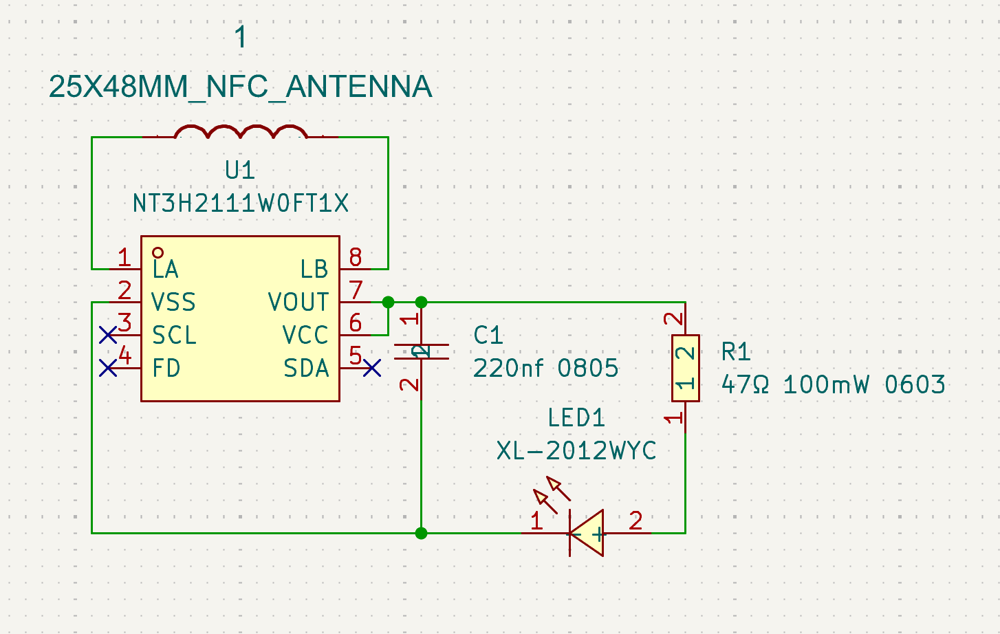
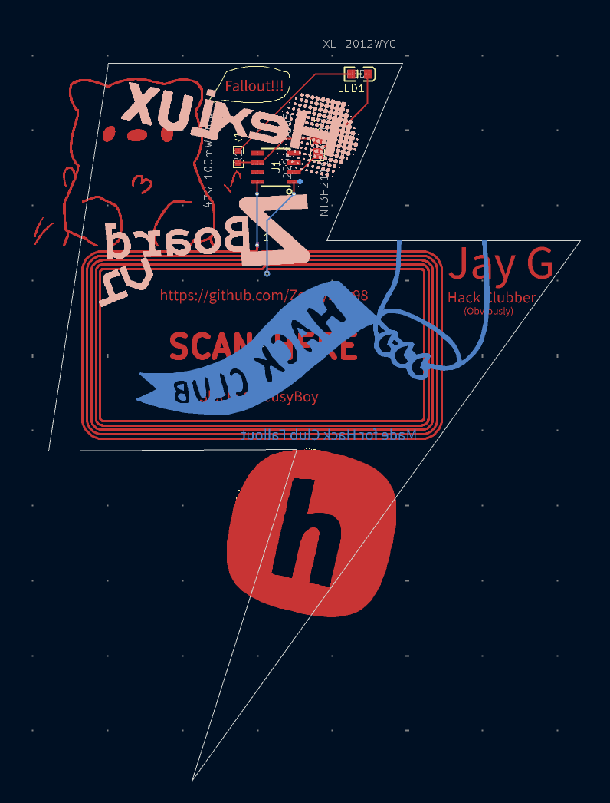
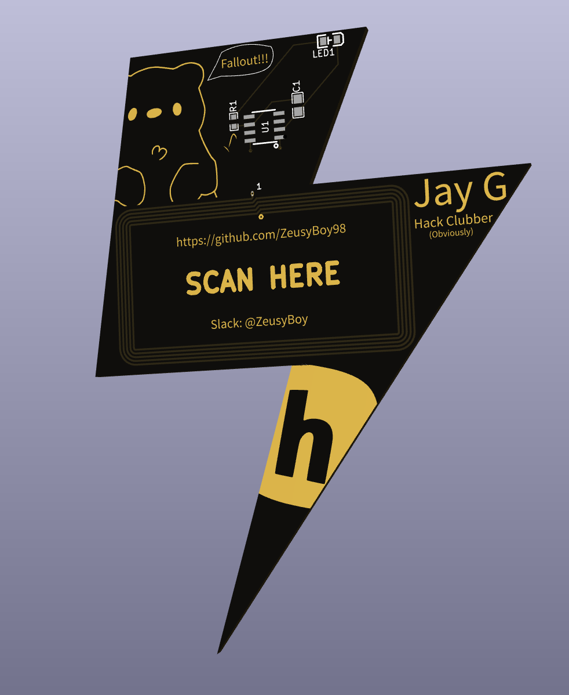

# PCB-Badge
Intro project for Fallout, cool badge in the shape of lightning bolt (Because ZeusyBoy). Has NFC so people can get my github.

## BOM
| Item                            | Quantity |
| ------------------------------- | -------- |
| NT3H2111W0FT1X (NFC Controller) | 1        |
| Yellow LED 0805                 | 1        |
| Capacitor 220nf 0805            | 1        |
| Resistor 47Ω 0603               | 1        |

## Images

## Slack
@ZeusyBoy